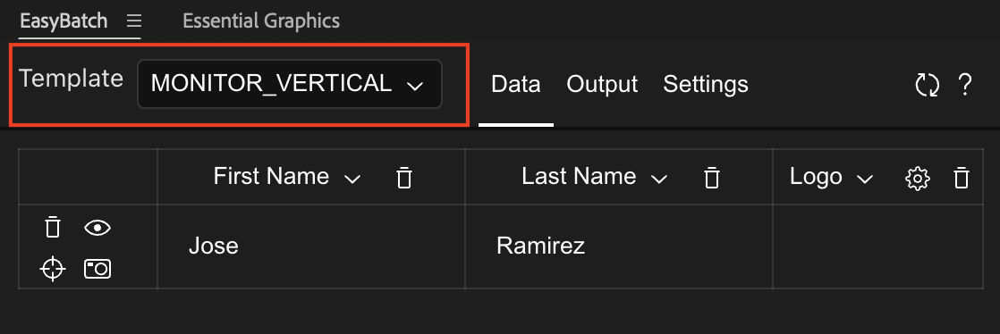
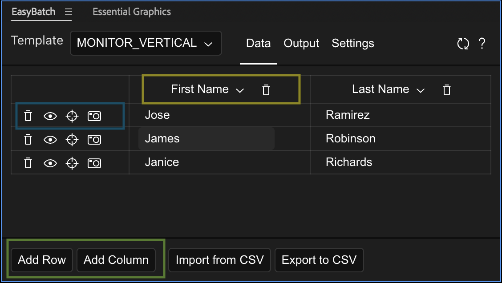

# Getting Started

### Install The Extension

1. You can use ZXPInstaller to install the extension package. Download ZXPInstaller [here.](https://zxpinstaller.com/)
2. Download the EasyBatch release package [here](https://github.com/gabriel-ar/Ae-EasyBatch/releases).
3. Open ZXPInstaller
4. Drag and drop the `EasyBatch.zxp` inside ZXPInstaller.
5. If open, restart After Effects.

### Your First Template

<iframe width="560" height="315" src="https://www.youtube.com/embed/RliiWGdY_nU?si=5xt8QpTTe-ZrVhAY" title="YouTube video player" frameborder="0" allow="accelerometer; autoplay; clipboard-write; encrypted-media; gyroscope; picture-in-picture; web-share" referrerpolicy="strict-origin-when-cross-origin" allowfullscreen></iframe>

#### A. Setup the Motion Graphics Template
1. Open your Motion Graphics Panel: `Window` > `Essential Graphics Panel`
2. Select the composition that you want to make a template
3. Assign a name to the template, this is the same name that the extension will use to pull the Template. **Important:** Don't have two templates with the same name, the extension uses the name to differentiate them.
4. Drag the properties that you would like to make editable from the composition to the Motion Graphics panel. **Important:** Make sure to assign a relevant and unique name. The extension will not properly recognize a template with repeated property names.

#### B. Setup the Extension
5. Open the extension in `Window` > `Extensions` > `EasyBatch`
6. In the dropdown in the top bar, select your template. If you don't see it, use the reload button at the left of the top bar. If you still don't see the template, make sure it has at least one property.

7. In the `Data` tab you will be able to see a table with at least one column matching a property from your template. 

    To add more columns use the `Add Columns` button at the bottom of the extension (in green). Add columns for as manny properties you wish. In order to change what property is displayed on that column, use the dropdown menu on the header of the column (in yellow). The choice of columns and order doesn't affect the data that's applied to the template.

    

8. To preview the template with the data, use the eye button on each row (blue).

9. Start adding data to the table. Each row will become a separate render. The following property types can be edited in the extension:
    - Numbers: Yoou can drag the axis (Eg. x) left and right and will increment or decrement the number.
    - Colors: Click on the color box to open the color picker or copy the hex code in the text box below.
    - Text: Just click the textbox and edit.
    - Images/Videos/Repleacebles: You can either select these one by one, or you can give the expention a pattern to find these files.

#### C. Export
9. Go to the `Export` tab on the    top bar.
10. Select the mode. You can either create renders, or you can genererate compositions with the updated values. This feature could be useful if the project will edited by other withouth access to the extension.
11. The `File Path/Name Pattern` defines the pattern that the extension will use to name the exported files. This pattern can also create folders.
    - For starters, click on `Select Base Path`, for now, this will be the folder that holds all our renders.
    - In the dropdown to the left of the `Add Field` button, select `Base Path`. Now click on `Add Field`. This will add {base_path} to the pattern.
    - Check the `Preview` section below, the `{base_path}` field on the pattern has been replaced by the path you selected.
    - Other fields availble are `Increment`, `Template name`, `Index` and every property from your template. Meaning that you can use the date of every row to name the render file.
    - To get started you could use something like `{base_path}/mytemplate_{index}.mov`
12. In order to set the render settings you need to use a template. Choose a template for the render settings and output module.
13. Whenever you're ready hit `Render`

