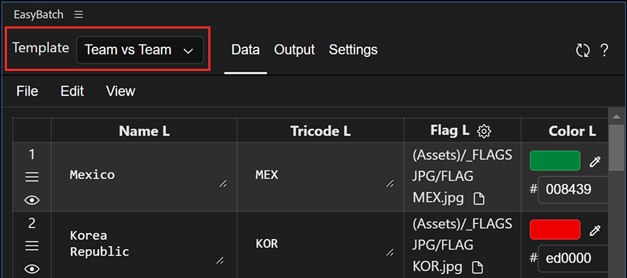
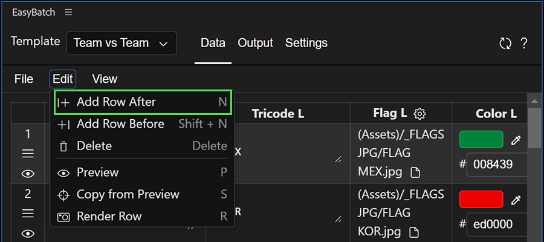
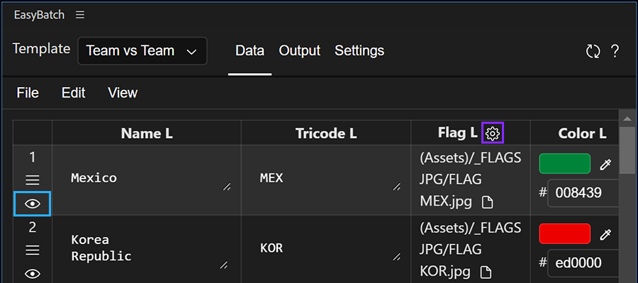
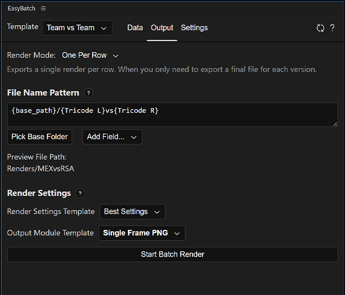

# Getting Started

<iframe width="auto" style="aspect-ratio:1.77" src="https://www.youtube.com/embed/Mx7asOxHmfQ?si=a1bc1DjFvpqHD2SJ" title="YouTube video player" frameborder="0" allow="accelerometer; autoplay; clipboard-write; encrypted-media; gyroscope; picture-in-picture; web-share" referrerpolicy="strict-origin-when-cross-origin" allowfullscreen></iframe>

## Your First Template
### A. Set Up the Motion Graphics Template
1. Open the Essential Graphics panel: `Window` > `Essential Graphics Panel`
2. Select the composition that you want to use as a template.
3. Assign a name to the template. This is the same name that the extension will use to find the template.
4. Drag the properties that you want to make editable from the composition to the Motion Graphics panel. **Important:** Assign each property a relevant, unique name. The extension will not properly recognize a template with repeated property names.

### B. Set Up the Extension
5. Open the extension in `Window` > `Extensions` > `EasyBatch`
6. In the dropdown in the top bar, select your template. If you do not see it, use the reload button on the left side of the top bar. If you still do not see the template, make sure it has at least one property.

    

7. The `Data` tab displays your template's Essential Graphics properties as columns. Each row you add becomes a variation of your template.

    To add more rows, press the letter `n` while you are in the extension, or open the `Edit` menu and select `Add Row After`.

    

8. To preview the template with the data, use the blue eye button on each row. You can also press `p` on your keyboard while you are in the extension.

9. Start adding data to the table. Each row becomes a separate render when you use the `One Per Row` render mode. The following property types can be edited in the extension:
    - **Numbers:** Drag the axis (for example, `x`) left or right to increment or decrement the number.
    - **Points:** Edit the `X` and `Y` values, which can represent a position, scale, and more.
    - **Colors:** Click the color box to open the color picker, or copy the hex code from the text box below it.
    - **Text:** Click the text box and edit the value.
    - **Dropdowns:** Choose from a list of preselected options added using the Expression Control `Dropdown Menu Control`.
    - **Checkboxes:** Use true/false or yes/no values added using the Checkbox Expression Control.
    - **Images, videos, and replaceables:** Select these files individually, or give the extension a pattern to find them. To edit this pattern, use the cog icon next to the property (purple).

    

### C. Export
10. Go to the `Output` tab in the top bar.

    

11. Select the `Render Mode`. `One Per Row` is the simplest option. It replaces the values in your template composition and renders it.
12. Use the `File Name Pattern` to generate the path where each file will be saved. You can use property values from each row to name the corresponding file.
    - Click `Select Base Path`. For now, this is the folder that will hold all your renders.
    - In the dropdown to the left of the `Add Field` button, select `Base Path`. This adds `{base_path}` to the pattern.
    - Check the `Preview` section below. The `{base_path}` field in the pattern is replaced with the path you selected.
    - Other available fields include `Increment`, `Template Name`, `Index`, and every property from your template. You can use the data from each row to name the corresponding render file.
    - To get started, use a pattern such as `{base_path}/mytemplate_{index}.mov`.
13. `Render Settings` uses the templates you set up in After Effects for your renders. Choose a template for the render settings and output module.
14. When you are ready, click `Render`.

