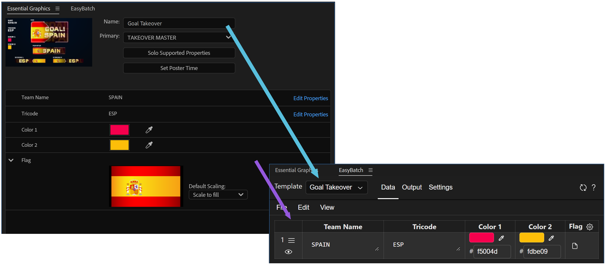

# Setup

EasyBatch reads templates from After Effects compositions that have an Essential Graphics template. Set up the composition and its editable properties in After Effects first; the extension then turns those properties into editable data columns.

## Create a Template in After Effects

1. Open the composition you want to use as a template.
2. Open `Window` > `Essential Graphics` (or the Essential Graphics panel in your After Effects version).
3. Select the composition in the Essential Graphics panel.
4. Set the template name.
5. Drag each property from your comp that should vary between rows from the composition into the Essential Graphics panel.
6. Give every exposed property a clear, unique name.

EasyBatch scans compositions that contain at least one Essential Graphics controller. A composition without exposed properties is not a useful EasyBatch template and may not appear in the template list.

## How the Template Appears in EasyBatch

When EasyBatch scans the project, each exposed Essential Graphics property becomes a column in the `Data` tab. Its name becomes the column name and can also be used as a pattern field, such as `{Country Name}`. The property's After Effects value is used as the initial value for the first row.

For details about editing values, supported property types, replaceable sources, and CSV formatting, see [Data Tab](tab-data.md).

## Naming Properties

Use names that describe the value and remain stable throughout the project. Names are used in the Data tab, CSV headers, file path patterns, and generated composition names.

Property names must be unique within a template. Repeated names make it ambiguous which column or pattern field should be used. Avoid changing a property's name after you have created CSV files or patterns that refer to it; if you do rename it, update those files and patterns as well.

## Refreshing the Extension

After creating or changing a template in After Effects:

1. Save the project if you want the template setup to persist with the project.
2. Return to EasyBatch.
3. Click the reload button in the extension header.
4. Select the template from the template dropdown if it is not selected automatically.

Reloading makes EasyBatch rescan the project and update its columns. Existing EasyBatch data and template-specific settings are retained when the same composition is found again.

If the template does not appear, check that:

- the composition is selected in the Essential Graphics panel;
- the template has at least one exposed property;
- each exposed property has a unique name; and
- the extension was reloaded after the template was changed.

## Previewing the Setup

Select a row in the `Data` tab and use its Preview button. EasyBatch creates or updates the `TemplatePreview` composition and applies the row's values to the template. This is a useful check that the exposed properties are connected to the intended layers and controls.

You can enable automatic preview in `Settings` > `Automatically preview when changing values`. With automatic preview enabled, edits to the selected row are sent to After Effects as you make them. You can disable it while setting up many properties or values, then preview a row manually when you are ready.

## Recommended Setup Check

Before importing a large data file or configuring output paths, test the template with one or two rows:

1. Confirm that every intended property appears as a column.
2. Preview a row in After Effects and confirm that the template responds.
3. Configure a simple output pattern and render one row.

Once the test works, add more rows or import CSV data. See [Data Tab](tab-data.md) for editing and importing data, and [Output Tab](tab-output.md) for render modes and output configuration.
