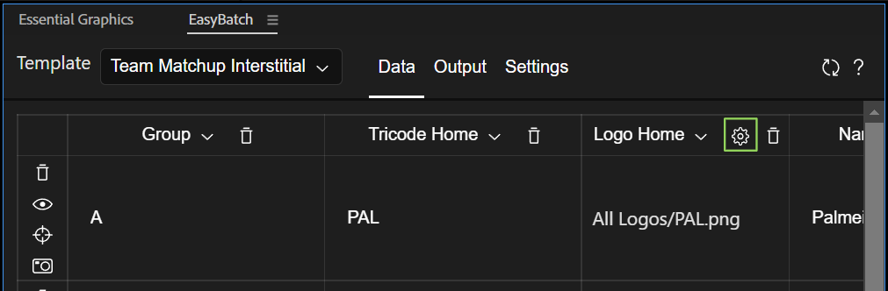
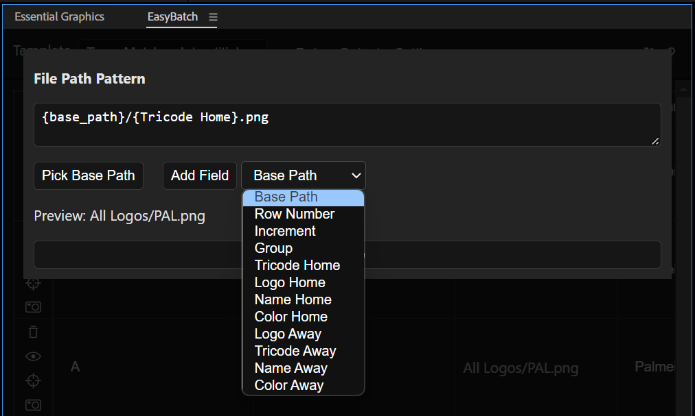

The columns of the data tab will display the properties that you added to the template. Then, each row corresponds to a single render that will be generated by the extension.

#### Working With Rows and Columns
Notice that all your template properties are not visible the first time you open a template in the extension. To add columns use the `AddColumn` button (green). In order to change the properties assigned to each column, click on the header of each column (in yellow) and using the dropdown, select the property you want to see. The visibility of the columns doesn't affect the data is actually applied to the templates.

To hide a column from the view click on the trash icon at the header of each column.

#### Row Icons (blue)

- Trash Can: Deletes the row.
- Eye: Previews the current row. It works by putting the template composition and changing the Essential Properties with the values of the row.
- Target: Copies the current values of the layer inside the `TemplatePreview` composition to the current row. Useful if you want to use the color picker of AfterEffects instead of the extension's. It will not copy the text values. See [known issues](known-issues.md).
- Camera: Render this row only. You still need to setup the Output, otherwise the render won't work.

#### Importing CSV data.
Coma Separated Values is a file format that allows to save data in the form of a table, similar to a spreadsheet. To import a CSV file into the extension, you need to make sure the name of each column matches with the names of the properties in your template. If the columns of the imported file don't match, the extension will ignore this data. Also the values need to be formatted correctly, depending on the type:

- Text: The text can be just written in the cells, but beware that line breaks (multiline text) may expose unexpected behavior in the extension.
- Color: The colors need to be formatted in an RGBA array of 4 numbers, between 0 and 1. Eg. pure red is: `1,0,0,1` white is: `1,1,1,1` and gray is `0.5,0.5,0.5,1`
- Position: The position of 2d and 3d layers are represented with an array of 3 numbers. Eg layer in the middle of a full HD frame: `960,540,0`
- Scale: The scale is represented with an array of 3 numbers, in percentages. Eg a layer scaled to default value: `100,100,100`
- Values: any other single dimensional value can be just written in the cell
- Images or Videos: As of now, the extension doesn't allow to input the file paths for *Replaceables*, to work with these, check the replaceables section below.

#### Replacing Images or Footage in Templates
We call this properties *replaceables*. As of now in order to work with these, you need to define the path with a pattern.

The replaceable properties will have a cob icon on their columns (in green). Click on it to configure the pattern used to import the files from storage.

##### Preview
The preview will be showing you the resulting path where the extension is going to search for the file. The preview will always use the first row as a sample.

##### Field: Base Path
Most of the times the patterns will include a base path, this is the folder the assets you want to import have in common. 
To select a base path, click on the `Pick Base Path` button. The add it to the pattern: Click on the dropdown at the left of `Add Field`, and select `Base Path`, then click on `Add Field`. This is the same as if you typed `{base_path}` inside the pattern.

##### Field: Row Number
It will replace `{row_number}` with the current row index. If you have 20 renders, the first one will be `0` and the last one `19`.

##### Field: Increment
It will generate an increment. `{increment:0000}` will  be replaced with `0000` for the first row, and with `0001` for the following row. The increment keeps the leading 0s, and you can determine how many of them to place. Also, you can determine the starting number: `{increment:050}` will be replaced with `050` and the next render will be replaced with `051`.

##### Field: Custom
You can also add the values of any template property as part of the pattern. In the case of the screenshot above `{Tricode Home}` will be replaced with `PAL` as this is the value of the column Tricode Home for the first row. For every consecutive row (and therefore render), this will be updated to match the value of Tricode Home for that row.