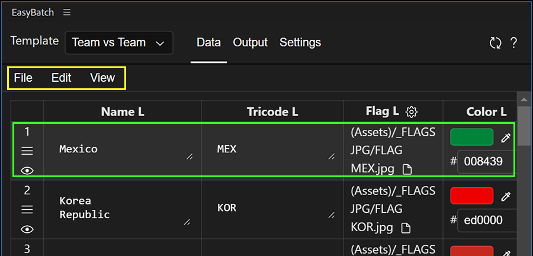
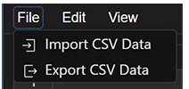
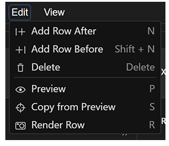
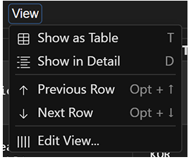
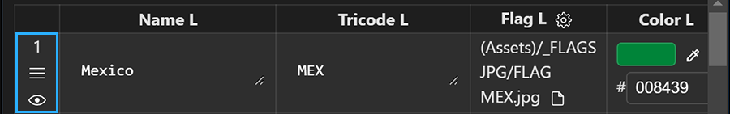
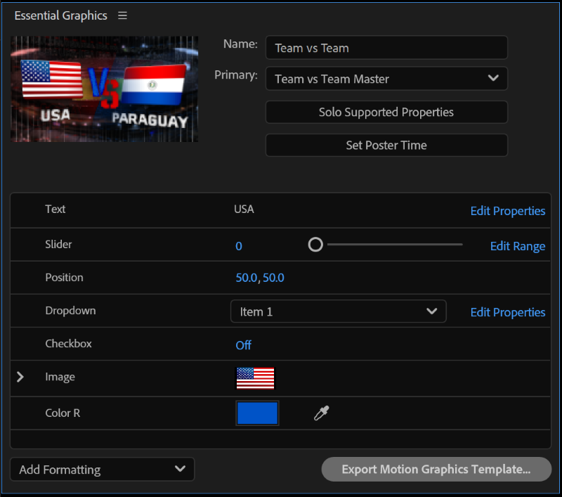
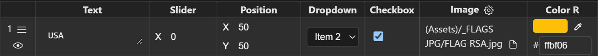
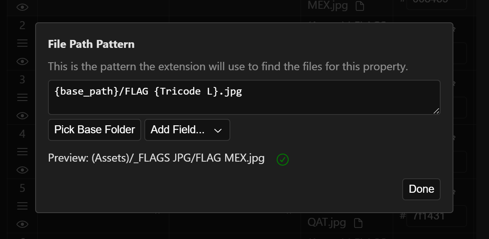

The `Data` tab is where you will edit the versions of your template. Each property in your Essential Graphics template becomes a column in the `Data` tab. Each row then becomes a variation of your render.

## The Basics

### What Is a Row? (Green)
Each row is a version of your template. You can add, remove, and edit rows as needed. You can also import rows from a CSV file. EasyBatch supports the same property types as Essential Graphics. In the simplest render setup, each row becomes a separate render.

| Property type | How it is edited |
| --- | --- |
| Text | Enter text directly, including multiple lines. |
| Number / Slider | Type a value, use the arrows, or drag horizontally. |
| Point / Two Dimension Number | Edit the `X` and `Y` values or drag them horizontally. |
| Three Dimension Number | Edit the `X`, `Y`, and `Z` values. |
| Color | Use the color picker or edit the color value. |
| Dropdown | Select one of the options from the Dropdown Menu Control. |
| Checkbox | Set the value using the checkbox control. |
| Image / Replaceable | Choose a file for the row or configure a file path pattern. |

### Top Bar Menus (Yellow)
!!! tip "Use Shortcuts"
    All menu actions display their equivalent shortcut on the right. Shortcuts work only while the extension is focused.

#### File

Import or export data in CSV format. This is helpful if you want to edit the data outside After Effects or if you have an external data source. Because the data must be provided in a specific format, we recommend that you export at least one row of your template as a CSV file and then modify that file. For instructions on CSV formatting, see *Importing CSV Data* below.

#### Edit

These are the editing options for the selected row.

- **Add Row After/Before:** Adds a row before or after the current row by duplicating its data. This is useful when you want to modify only a few properties.
- **Delete:** Deletes the currently selected row. The extension does not have an undo function yet.
- **Preview:** Previews the selected row's data in the selected template. This operation loads a composition called `TemplatePreview`, which contains a layer that references your template. The extension then replaces the Essential Properties to match the row.
- **Copy from Preview:** If you are editing the template in After Effects' Properties panel while the `TemplatePreview` composition is open, this copies the properties from the preview to the row. This is useful when you are editing properties that require precision, since the extension preview does not update as frequently.
- **Render Row:** Renders the current row. Configure the render before using this option; see [Tab: Output](tab-output.md).

#### View

- **Show as Table:** Displays the default view.
- **Show in Detail:** Displays only the current row and makes it easier to edit templates with many properties.
- **Previous/Next Row:** Changes the currently selected row. This is useful in Detail View mode.
- **Edit View...:** Opens a dialog that allows you to hide or reorder columns and properties in the table and detail views.

`Edit View...` controls which properties are visible and the order in which they appear. These choices apply to both the table and detail views; they do not remove properties from the template or delete their data.

### Row Options (in blue)

- **Row number:** Displays the row number. You can use this number to name your renders.
- **Row menu:** Click to open the Edit menu, the same menu that opens from the top bar or when you right-click the row.
- **Preview button:** Previews your template with the row's data.

## Editing Properties

{ width="500" }

All the properties that you see on EasyBatch start in the Essential Graphics panel. EasyBatch supports all types of properties that can be added to an Essential Graphics template.

### Text
This property is created when you drag the `Source Text` property of a text layer into the Essential Graphics panel. It supports multiple lines and special characters. You can expand the text-editing box by dragging its corner.

### Slider/Number
Created by dragging any numeric property or the `Slider` Expression Control into Essential Graphics. You can type the number or use the arrows to move up and down.

You can also drag horizontally on the value to change the number.

### Point/Two Dimension Number
Created by dragging any two-dimensional property into the Essential Graphics panel. Like the slider property, the values can be typed directly, or you can drag the `X` and `Y` values to change them quickly.

### Dropdown
Created by dragging a `Dropdown Menu Control` Expression Control into the Essential Graphics panel.

### Color
Created by dragging a color property into the Essential Graphics panel. Use the color control to choose a color or edit its value directly when precision is important.

### Checkbox
Created by dragging a Checkbox Expression Control into the Essential Graphics panel. Each row can enable or disable the property independently.

### Image/Replaceable
This is the most complex type of property. It is created by dragging an image or movie layer into the Essential Graphics panel. You can load the image for each layer manually by clicking the file icon in each cell of the column.

The extension also provides a way to load images that follow a pattern. EasyBatch allows you to use a pattern to load these files.

#### Patterns
{ width="500" }

The `File Path Pattern` allows you to use other properties to find a file. The preview includes an indicator showing whether the resolved path currently points to an existing file. A warning indicator means the file was not found at the previewed path.

The pattern is made up of `Fields`. A field can be another property of your template, the row number, or a custom increment. Fields are represented by braces in the pattern. Everything inside braces is replaced if it is a valid property. The pattern is evaluated for each row, using that row's property values to resolve the file path.

To add a field, open the `Add Field` dropdown and select one. Fields in bold represent special options:

- **Base Folder:** If your files are in a complex path, use a `Base Folder` field. When included in the pattern, it represents the path to the folder you select. The pattern and the base folder are relative to the project location.
- **Row Number:** The row number, starting at 0.
- **Increment:** A configurable increment. `{increment:0001}` produces `0001` for the first row and `0002` for the second row. `{increment:050}` produces `050` for the first row and `051` for the second row.
- ***Properties from your Template:*** The remaining options in the list are properties from your template.

!!! abstract "Basic Use Case Example"
    You have a template that requires a render for each country in the world. The template includes the country's flag. You already have a folder containing all the flags, and each flag is named with `FLAG` and the country name. You are already using the country name as a property in your template. You need a way to build a file path for the extension to import these files. To simplify your pattern, add a `Base Folder` field and select its value first.

    Your pattern could look like this: `{base_folder}/Flags/FLAG {Country Name}.jpg`.
    If the base folder is `(Footage)` and the `Country Name` property is `United States`, the extension resolves the path to `(Footage)/Flags/FLAG United States.jpg`.

!!! note "Paths are Relative to the Project"
    The path for this pattern should be relative to your `.aep` file. This is useful if you work on a shared drive or Dropbox and collaborate with other people.

    For example, if your project is saved at `C:/Projects/WorldMap/world-map.aep` and your flags are in `C:/Projects/WorldMap/Footage/Flags`, a pattern such as `Footage/Flags/FLAG {Country Name}.jpg` can resolve to `C:/Projects/WorldMap/Footage/Flags/FLAG United States.jpg`.

    You can also go backwards manually with `..` in a relative path. For example, if your project is at `D:/ClientWork/Promo/projects/promo.aep` and the images are stored in `D:/ClientWork/Promo/assets/products`, the pattern `../assets/products/{Product Name}.png` will resolve to `D:/ClientWork/Promo/assets/products/Headphones.png`.

## Automatic Preview

When automatic preview is enabled, changing a property updates the selected row's preview composition. This is useful for checking text, colors, dropdowns, and other values as you edit them. Preview updates can take a moment because EasyBatch must send the changed values to After Effects. You can also use the row Preview action to update the preview manually.

## Importing CSV Data
**Comma-Separated Values** is a file format that stores data in a table, similar to a spreadsheet. To import a CSV file into the extension, select a CSV file and map its columns to properties in your template. Values must also be formatted correctly, depending on the type:

The import dialog maps CSV columns to template properties automatically when their names match. Matching is case-insensitive and also tolerates common differences such as spaces, underscores, hyphens, and periods. You can change a mapping manually or choose `Do not import`. Unmapped properties keep their existing values.

- **Text:** Write the text directly in the cells. Line breaks (multiline text) may cause unexpected behavior in the extension.
- **Color:** Format colors as an RGBA array of four numbers between 0 and 1. In a CSV file, quote values containing commas. For example, pure red is `"1,0,0,1"`, white is `"1,1,1,1"`, and gray is `"0.5,0.5,0.5,1"`.
- **Position:** Represent the position of 2D and 3D layers with an array of three numbers. For example, a layer in the middle of a full HD frame is `"960,540,0"`.
- **Scale:** Represent the scale as an array of three numbers in percentages. For example, a layer at its default scale is `"100,100,100"`.
- **Values:** Write any other one-dimensional value directly in the cell.
- **Images or videos:** The extension currently does not allow file paths to be entered for *replaceables*. To work with these files, see the replaceables section above.

Export one or more rows from EasyBatch first when creating a CSV template. This preserves the expected column order and value formatting. The current importer is CSV-only; workbook and sheet importing are not yet live.

