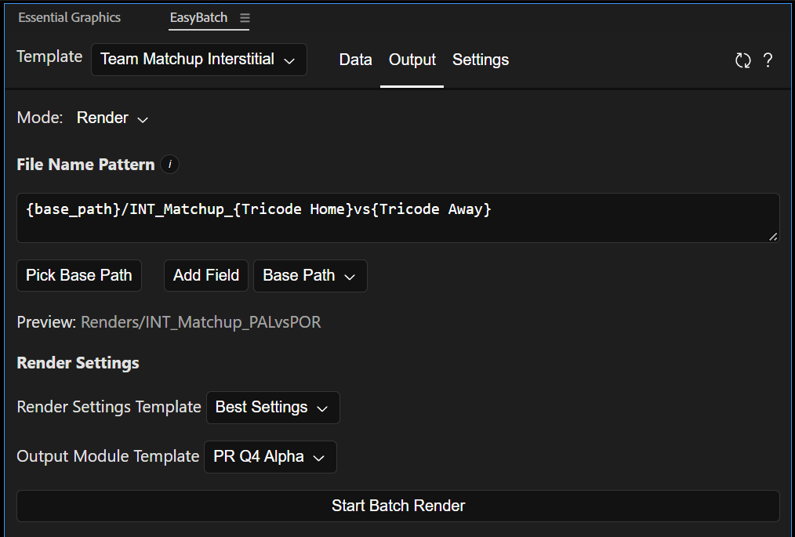
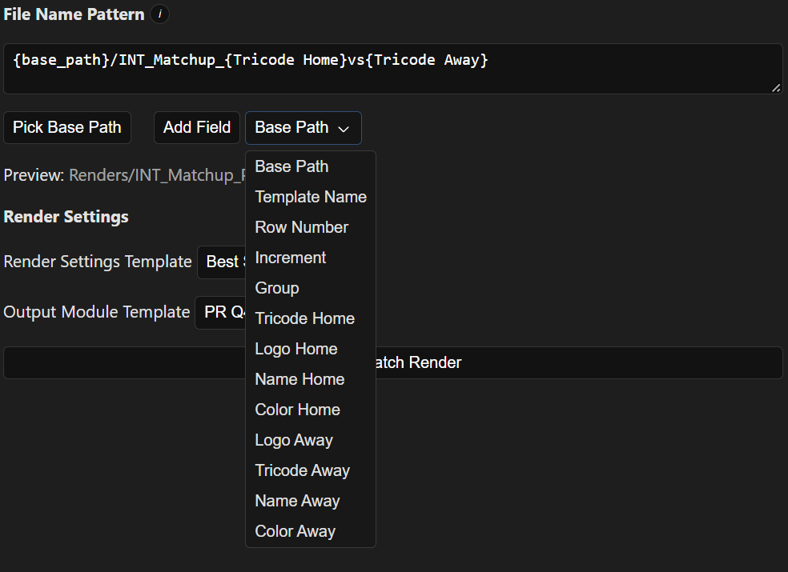
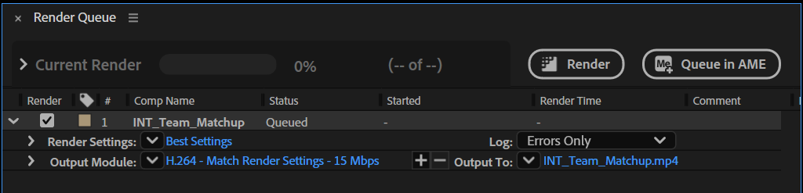

In this page you'll find all the configurations to render the  template.

#### Mode
The output can work in two modes:

- Render: This mode will output files to your drive.
- Generate Comps: This mode will generate one composition for each row, with the properties replaced with your data. This could be useful is a user had to modify the resulting compositions with no access to EasyBatch.

#### File Name Pattern
This feature allows you to give dynamic names and paths to your renders. This pattern will be interpreted for each render you do to generate the final path for that file.

In the screenshot above, the pattern `{base_path}/INT_Matchup_{Tricode Home}vs{Tricode Away}` will be replaced as `Renders/INT_Matchup_PALvsPOR`, where the file named `INT_Matchup_PALvsPOR` will be placed inside the folder `Renders`.

If you include `/` in the pattern, this will interpreted as a subfolder, the pattern is capable of dynamically creating these subfolders.

The pattern is made up of fields, in the case above `{base_path}`, `{Tricode Home}` and `{Tricode Away}` are fields.

##### Field: Base Path
Most of the times the patterns will include a base path, this is the folder that all the renders have in common. If you select a folder in the same drive, you'll see that the path will be relative (doesn't include the drive letter), and this will greatly help to keep the project portable. The path is relative to the project.

To select a base path, click on the `Pick Base Path` button. The add it to the pattern: Click on the dropdown at the left of `Add Field`, and select `Base Path`, then click on `Add Field`. This is the same as if you typed `{base_path}` inside the pattern.

In the screenshot above, we selected the folder `Render`, which is located inside the same folder where the project is saved. Since our path is relative to the location of the project, it is saved as `Render/`.

##### Field: Template Name
It will replace `{template_name}` with the name of the template (surprise!!!), in this case will result in `Team Matchup Interstitial`.

##### Field: Row Number
It will replace `{row_number}` with the current row index. If you have 20 renders, the first one will be `0` and the last one `19`.

##### Field: Increment
It will generate an increment. `{increment:0000}` will  be replaced with `0000` for the first row, and with `0001` for the following row. The increment keeps the leading 0s, and you can determine how many of them to place. Also, you can determine the starting number: `{increment:050}` will be replaced with `050` and in the next render will become `051`.

##### Field: *Custom*
You can also add the values of any template property as part of the pattern. In the case of the screenshot above `{Tricode Home}` will be replaced with `PAL` as this is the value of the column Tricode Home for the first row. For every consecutive row (and therefore render), this will be updated to match the value of Tricode Home for that row.

!!! note "Backslashes in Windows"

    Beware, in both Windows and Mac, you should be using forward slashed to define directories.

#### Render Settings

In order to define the render configuration for all the files generated using this template, you need to select a preset for both Render Settings and the Output Module.

- Render Settings: Same as selecting a render settings template in the render queue. It affects the Quality, Resolution, Proxy, etc.
- Output Module: Same as selecting an output module in the render queue. It affects the codec, compression, audio, etc.

To make a template, add any composition to the render queue, click on the down facing arrow to the left of `Output Module` and click on `Make Template...`

