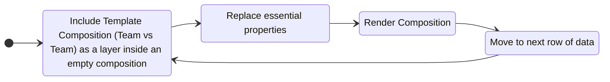
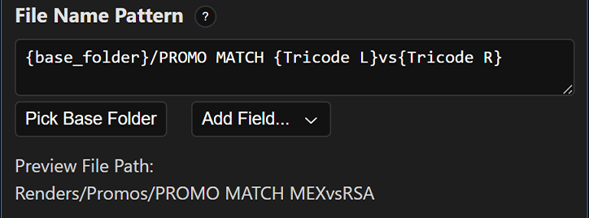
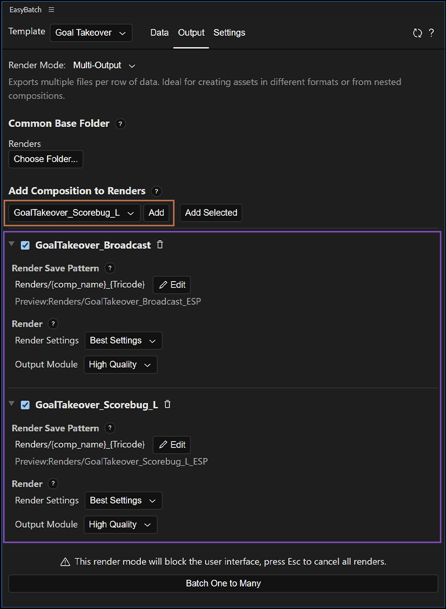
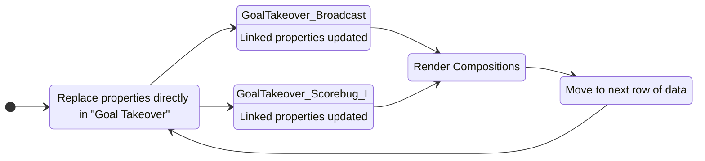

The `Output` tab is where you configure how your renders are generated and where they are saved. You can choose between rendering files and generating compositions, define dynamic file name patterns, and select the render settings and output module for the generated files.

## Render Modes
Render modes define what the extension does with each row.

| Mode | Creates | Renders files | Best for |
| --- | --- | --- | --- |
| One Per Row | Temporary render compositions | Yes | One output per data row |
| Multi-Output | Uses selected project compositions | Yes | Several outputs per data row |
| Generate Comps | Editable project compositions | No | Hand-off or post-processing |

## Render Mode: One Per Row
This is the simplest mode. Each row is applied to the template and then exported in the format you define below.

Internally, EasyBatch performs these actions:

```mermaid
stateDiagram-v2
    direction LR
    [*] --> IncludeComposition
    IncludeComposition: Include Template Composition (Team vs Team) as a layer inside an empty composition
    IncludeComposition --> ReplaceProperties
    ReplaceProperties: Replace essential properties
    ReplaceProperties --> RenderComposition
    RenderComposition: Render Composition
    RenderComposition --> NextRow
    NextRow: Move to next row of data
    NextRow --> IncludeComposition
```

### File Name Pattern
This feature allows you to give your renders dynamic names and paths. The pattern is interpreted for each render to generate the final file path. You do not need to include a file extension: the selected Output Module supplies the format and extension.

In the screenshot above, the pattern `{base_folder}/PROMO MATCH {Tricode L}vs{Tricode R}` will be replaced as `Renders/Promos/PROMO MATCH MEXvsRSA`.

If you include `/` in the pattern, it is interpreted as a subfolder. The pattern can therefore create subfolders dynamically.

The pattern is made up of fields. In the example above, `{base_folder}`, `{Tricode L}`, and `{Tricode R}` are fields. The available fields are:

- **Base Folder**:
A `Base Folder` allows you to select a folder instead of typing its path into the pattern. Typically, this is the folder that all your renders have in common. If you select a folder on the same drive as the project, the path will be relative and will not include the drive letter. This helps keep the project portable.

    To select a base folder, click the `Pick Base Folder` button. To add it to the pattern, click `Add Field` and select `Base Folder`. This is equivalent to typing `{base_folder}` in the pattern.

    In the screenshot above, we selected the folder `Renders/Promos`, where `Renders` is located in the same folder as the project. Because the path is relative to the project location, it is saved as `Renders/`.

- **Template Name**:
Replaces `{template_name}` with the name of the template (surprise!). In this case, it produces `Team vs Team`.

- **Composition**:
In Multi-Output mode, replaces `{comp_name}` with the name of the composition being rendered. This field is available in each composition's render pattern.

- **Row Number**:
Replaces `{row_number}` with the current row index. If you have 20 renders, the first one is `0` and the last one is `19`.

- **Increment**:
A configurable increment. `{increment:0001}` produces `0001` for the first row and `0002` for the second row. `{increment:050}` produces `050` for the first row and `051` for the second row.

- **Custom**:
You can also add the value of any template property to the pattern. In the screenshot above, `{Tricode L}` is replaced with the value in the `Tricode L` column for the current row. For every subsequent row and render, this value is updated to match that row.

!!! note "Backslashes in Windows"
    In both Windows and macOS, use forward slashes to separate directories.

### Render Settings

To define the render configuration for all files generated from this template, select a preset for both Render Settings and the Output Module.

- **Render Settings:** Equivalent to selecting a render settings template in the Render Queue. It affects quality, resolution, proxy settings, and more.
- **Output Module:** Equivalent to selecting an output module in the Render Queue. It affects the codec, compression, audio, and more.

To edit these templates, click `Edit` > `Templates` in the After Effects menu bar, then select the templates you want to modify.

### Render
When you are ready, click `Start Batch Render`. EasyBatch resolves the pattern for every row before queueing. It checks for duplicate paths in One Per Row mode and will not queue the batch until duplicate paths are fixed.

### Render Results and Queue Behavior

After queueing, the Output tab displays a result for each row. The result shows whether the row was queued, the resolved output path, and any warning or error returned while applying the row's properties.

EasyBatch clears the existing After Effects render queue before adding the batch, then starts the queue asynchronously. Queueing results can appear before encoding finishes. On Windows, After Effects may block the extension while the render queue is running; see [Known Issues](known-issues.md) for details.

## Render Mode: Multi-Output
This is the most complex mode. Instead of creating a reference of your template composition and changing its Essential Properties, the extension modifies the properties of your original composition.

This is useful if you want to export more than one composition per row. For example, several compositions could have properties linked to your main template. Because this mode changes the properties in the template itself, you can export compositions that reference the main template with those properties applied.

{width="500"}

For the previous example, the extension performs these actions:

```mermaid
stateDiagram-v2
    direction LR
    [*] --> ReplaceProperties
    ReplaceProperties: Replace properties directly in "Goal Takeover"
    ReplaceProperties --> Comp1
    ReplaceProperties --> Comp2
    Comp1: GoalTakeover_Broadcast
    Comp1: Linked properties updated
    Comp2: GoalTakeover_Scorebug_L
    Comp2: Linked properties updated
    Comp1 --> RenderComposition
    Comp2 --> RenderComposition
    RenderComposition: Render Compositions
    RenderComposition --> NextRow
    NextRow: Move to next row of data
    NextRow --> ReplaceProperties
```

### Render Compositions (Purple)
These are the compositions that the extension renders in this mode. You can add any composition in the project, including the Template Composition.

To add a composition, click the dropdown (orange) below `Add Compositions to Renders`, then select a composition. You can type to search. After selecting a composition, click `Add`. Alternatively, select one or more compositions in the Project panel, then click `Add Selected` and they will be added to the list of compositions to be rendered.

#### Disable Render
At some point, you may not need to render all the compositions you added. Use the checkboxes to prevent them from rendering.

#### Delete Comp
Click on the trash icon to remove the composition from the list.

#### Pattern
Each composition uses a pattern as well. This pattern works the same way as the pattern in `One Per Row` mode. The main difference is that all render compositions share the same base folder for convenience.

In the example pictured, the compositions have the same pattern. This works because the pattern uses the composition name and the country code to save each file, so every file has a unique name.

!!! tip "Pro Tip"
    Whenever you add a composition to the renders, its configuration is copied from the previous composition, including the pattern. If you have several compositions that use the same pattern, setting up the first one carefully can save time.

Each Render Composition will have a pattern preview. The available fields are `{base_folder}`, `{template_name}`, `{comp_name}`, `{row_number}`, `{increment:0000}`, and template properties. Duplicate paths are reported because they can cause files to be overwritten.

#### Render Settings

The render settings work the same way as in `One Per Row` mode. Each export can have a different configuration.

##### Output Module: Single Frame as PNG
This is a special mode provided by the extension that lets you save the composition as a single-frame PNG. Compared with using a preset, the main advantage is that this mode does not attach sequence numbers to the exported file, which is otherwise unavoidable.

In this mode, the render is not queued. Therefore, if all your compositions are being exported as Single Frame PNG, After Effects may appear to be idle even though the frames are being exported.

!!! warning "32 bit projects"
    This mode may not work properly in 32-bit projects.

### Render
When you are ready, click `Batch One to Many`.
    
## Render Mode: Generate Comps
This mode generates one composition per row and replaces its properties with the corresponding row data. Use it when you need to modify the resulting compositions without access to EasyBatch.

### Composition Name Pattern

The composition name pattern uses `{template_name}`, `{row_number}`, `{increment:0000}`, and template property fields. The pattern is resolved once for each row, and characters that are invalid in composition names are removed. Generated composition names should be unique so that the rows can be distinguished easily.

### Generated Compositions Folder

Use `Generated Comps Folder Name` to choose the project folder where EasyBatch creates the compositions. The default folder is `~Generated by EasyBatch`. This mode creates compositions only; it does not add them to the render queue or render files.

When you are ready, click `Generate Compositions`. EasyBatch creates one composition for each row, adds the template composition as a layer, and applies that row's properties. The generated compositions can then be edited or rendered using After Effects.